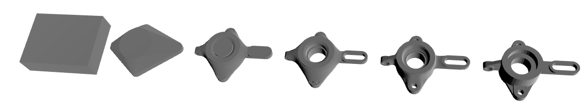

# Pricing Overview

Quantity | Base Price | Expedite Price | Expedite Subtotal | Expedite Lead Time | Standard Price | Standard Subtotal | Standard Lead Time | Economy Price | Economy Subtotal | Economy Lead Time | Machine Time | Machine Cost | Tool Used | Tool Cost | Material Cost | Material Waste Handling | Setup Cost | Expedite Fees | Standard Fees | Economy Fees | Expedite Margin | Standard Margin | Economy Margin | Risk Surcharge
--- | --- | --- | --- | --- | --- | --- | --- | --- | --- | --- | --- | --- | --- | --- | --- | --- | --- | --- | --- | --- | --- | --- | --- | ---
1 | $314.08 | $1399.94 | $1399.94 | 5 days | $798.67 | $798.67 | 6 days | $408.3 | $408.3 | 9 days | 11.41 minutes | $50.4 | 1.0 | $0.0 | $62.13 | $29.33 | $156.13 | $646.15 | $215.38 | $0.0 | $439.71 | $269.21 | $94.22 | $14.36
2 | $232.7 | $693.98 | $1387.96 | 5 days | $458.16 | $916.32 | 6 days | $286.36 | $572.72 | 9 days | 22.82 minutes | $100.8 | 1.0 | $0.0 | $124.26 | $58.66 | $156.13 | $257.93 | $85.98 | $0.0 | $203.35 | $139.48 | $53.66 | $22.08
3 | $205.35 | $543.31 | $1629.93 | 5 days | $373.64 | $1120.92 | 6 days | $247.06 | $741.18 | 9 days | 34.24 minutes | $151.2 | 1.0 | $0.0 | $186.39 | $87.99 | $156.13 | $190.85 | $63.62 | $0.0 | $147.11 | $104.67 | $41.71 | $29.16
4 | $191.58 | $474.39 | $1897.56 | 5 days | $333.57 | $1334.28 | 6 days | $227.46 | $909.84 | 9 days | 45.65 minutes | $201.6 | 1.0 | $0.0 | $248.52 | $117.32 | $156.13 | $161.12 | $53.71 | $0.0 | $121.69 | $88.28 | $35.88 | $35.84
5 | $183.27 | $434.02 | $2170.1 | 5 days | $309.79 | $1548.95 | 6 days | $215.63 | $1078.15 | 9 days | 57.06 minutes | $252.0 | 1.0 | $0.0 | $310.65 | $146.65 | $156.13 | $143.75 | $47.92 | $0.0 | $107.0 | $78.6 | $32.36 | $42.25
10 | $166.38 | $351.71 | $3517.1 | 6 days | $261.0 | $2610.0 | 7 days | $191.34 | $1913.4 | 10 days | 114.12 minutes | $504.0 | 1.0 | $0.0 | $621.3 | $293.3 | $156.13 | $107.69 | $35.9 | $0.0 | $77.64 | $58.72 | $24.96 | $71.8
15 | $165.83 | $332.27 | $4984.05 | 7 days | $251.25 | $3768.75 | 8 days | $188.69 | $2830.35 | 11 days | 171.18 minutes | $756.0 | 2.0 | $75.0 | $931.95 | $439.95 | $156.13 | $97.18 | $32.39 | $0.0 | $69.26 | $53.03 | $22.86 | $102.45
20 | $161.55 | $312.68 | $6253.6 | 8 days | $239.44 | $4788.8 | 9 days | $182.61 | $3652.2 | 13 days | 228.24 minutes | $1008.0 | 2.0 | $75.0 | $1242.6 | $586.6 | $156.13 | $88.34 | $29.45 | $0.0 | $62.79 | $48.44 | $21.06 | $128.0
25 | $162.08 | $306.11 | $7652.75 | 8 days | $236.51 | $5912.75 | 9 days | $182.36 | $4559.0 | 14 days | 285.3 minutes | $1260.0 | 3.0 | $150.0 | $1553.25 | $733.25 | $156.13 | $84.25 | $28.08 | $0.0 | $59.78 | $46.35 | $20.28 | $156.0

# Complexity

Overall Part Complexity Score: 66.77 (complex)

## Complexity Breakdown

- **material_removal_intensity**: 13.19 points (weight: 15%)
  - *How aggressively the part reduces stock (from stock→part volume).*
- **surface_amplification**: 15.23 points (weight: 20%)
  - *Increase in surface area per volume vs stock (complexity of skin/fixturing/finishing).*
- **face_complexity**: 13.86 points (weight: 15%)
  - *Triangle-count complexity (log-scaled so very large meshes don't dominate).*
- **sharp_edge_intensity**: 4.25 points (weight: 10%)
  - *Sharp-edge density (sharp edges per face), saturated.*
- **holes_and_orients**: 4.1 points (weight: 10%)
  - *Hole count and number of drilling orientations (setup/fixturing burden).*
- **detail_intensity**: 16.13 points (weight: 30%)
  - *Deep/medium/fine cavity volume fractions (tool reach & small-feature effort).*# Machining Summary

- **Machine Type:** haas_cnc_machine
- **Material Removal Rate from Stock -> Convex:** 400000 mm^3/min
- **Material Removal Rate for deep pockets:** 75000 mm^3/min
- **Material Removal Rate for holes:** 400000 mm^3/min
- **Material Removal Rate for large features:** 75000 mm^3/min
- **Material Removal Rate for fine features:** 15000 mm^3/min
- **Total Material Removed from Stock -> Convex:** 1742546.484 mm^3
- **Total Material Removed for deep pockets:** 210387.933 mm^3
- **Total Material Removed for holes:** 95473.33 mm^3
- **Total Material Removed for large features:** 80593.181 mm^3
- **Total Material Removed for fine features:** 44054.081 mm^3

# Per-Quantity Breakdowns

### Qty 1 — Unit Price Breakdown

**Fees:**
  - Base Price: $314.08
  - Expedite Fees: $646.15
  - Standard Fees: $215.38
  - Economy Fees: $0.0
  - Expedite Margin: $439.71
  - Standard Margin: $269.21
  - Economy Margin: $94.22

**Tools:**
  - Wear: $31.06
  - Tool Change Labor & Cost: $0.0

**Machine:**
  - Time Used: 11.41 minutes
  - Cost: $50.40

**Material:**
  - Stock Weight: 6.56 kg
  - Stock Price: $32.8
  - Waste Handling: $29.33
  - Total Material Cost: $62.13

**Setup:**
  - Cost: $156.13

**Risk:**
  - Complexity: 66.77 (complex)
  - Risk: 1.1
  - Applied Risk (Goes down at scale): 1.1
  - Cost: $14.36

### Qty 2 — Unit Price Breakdown

**Fees:**
  - Base Price: $232.7
  - Expedite Fees: $128.96
  - Standard Fees: $42.99
  - Economy Fees: $0.0
  - Expedite Margin: $101.68
  - Standard Margin: $69.74
  - Economy Margin: $26.83

**Tools:**
  - Wear: $31.06
  - Tool Change Labor & Cost: $0.0

**Machine:**
  - Time Used: 11.41 minutes
  - Cost: $50.40

**Material:**
  - Stock Weight: 6.56 kg
  - Stock Price: $32.8
  - Waste Handling: $29.33
  - Total Material Cost: $62.13

**Setup:**
  - Cost: $78.07

**Risk:**
  - Complexity: 66.77 (complex)
  - Risk: 1.1
  - Applied Risk (Goes down at scale): 1.08
  - Cost: $11.04

### Qty 3 — Unit Price Breakdown

**Fees:**
  - Base Price: $205.35
  - Expedite Fees: $63.62
  - Standard Fees: $21.21
  - Economy Fees: $0.0
  - Expedite Margin: $49.04
  - Standard Margin: $34.89
  - Economy Margin: $13.9

**Tools:**
  - Wear: $31.06
  - Tool Change Labor & Cost: $0.0

**Machine:**
  - Time Used: 11.41 minutes
  - Cost: $50.40

**Material:**
  - Stock Weight: 6.56 kg
  - Stock Price: $32.8
  - Waste Handling: $29.33
  - Total Material Cost: $62.13

**Setup:**
  - Cost: $52.04

**Risk:**
  - Complexity: 66.77 (complex)
  - Risk: 1.1
  - Applied Risk (Goes down at scale): 1.07
  - Cost: $9.72

### Qty 4 — Unit Price Breakdown

**Fees:**
  - Base Price: $191.58
  - Expedite Fees: $40.28
  - Standard Fees: $13.43
  - Economy Fees: $0.0
  - Expedite Margin: $30.42
  - Standard Margin: $22.07
  - Economy Margin: $8.97

**Tools:**
  - Wear: $31.06
  - Tool Change Labor & Cost: $0.0

**Machine:**
  - Time Used: 11.41 minutes
  - Cost: $50.40

**Material:**
  - Stock Weight: 6.56 kg
  - Stock Price: $32.8
  - Waste Handling: $29.33
  - Total Material Cost: $62.13

**Setup:**
  - Cost: $39.03

**Risk:**
  - Complexity: 66.77 (complex)
  - Risk: 1.1
  - Applied Risk (Goes down at scale): 1.06
  - Cost: $8.96

### Qty 5 — Unit Price Breakdown

**Fees:**
  - Base Price: $183.27
  - Expedite Fees: $28.75
  - Standard Fees: $9.58
  - Economy Fees: $0.0
  - Expedite Margin: $21.4
  - Standard Margin: $15.72
  - Economy Margin: $6.47

**Tools:**
  - Wear: $31.06
  - Tool Change Labor & Cost: $0.0

**Machine:**
  - Time Used: 11.41 minutes
  - Cost: $50.40

**Material:**
  - Stock Weight: 6.56 kg
  - Stock Price: $32.8
  - Waste Handling: $29.33
  - Total Material Cost: $62.13

**Setup:**
  - Cost: $31.23

**Risk:**
  - Complexity: 66.77 (complex)
  - Risk: 1.1
  - Applied Risk (Goes down at scale): 1.06
  - Cost: $8.45

### Qty 10 — Unit Price Breakdown

**Fees:**
  - Base Price: $166.38
  - Expedite Fees: $10.77
  - Standard Fees: $3.59
  - Economy Fees: $0.0
  - Expedite Margin: $7.76
  - Standard Margin: $5.87
  - Economy Margin: $2.5

**Tools:**
  - Wear: $31.06
  - Tool Change Labor & Cost: $0.0

**Machine:**
  - Time Used: 11.41 minutes
  - Cost: $50.40

**Material:**
  - Stock Weight: 6.56 kg
  - Stock Price: $32.8
  - Waste Handling: $29.33
  - Total Material Cost: $62.13

**Setup:**
  - Cost: $15.61

**Risk:**
  - Complexity: 66.77 (complex)
  - Risk: 1.1
  - Applied Risk (Goes down at scale): 1.05
  - Cost: $7.18

### Qty 15 — Unit Price Breakdown

**Fees:**
  - Base Price: $165.83
  - Expedite Fees: $6.48
  - Standard Fees: $2.16
  - Economy Fees: $0.0
  - Expedite Margin: $4.62
  - Standard Margin: $3.54
  - Economy Margin: $1.52

**Tools:**
  - Wear: $31.06
  - Tool Change Labor & Cost: $5.0

**Machine:**
  - Time Used: 11.41 minutes
  - Cost: $50.40

**Material:**
  - Stock Weight: 6.56 kg
  - Stock Price: $32.8
  - Waste Handling: $29.33
  - Total Material Cost: $62.13

**Setup:**
  - Cost: $10.41

**Risk:**
  - Complexity: 66.77 (complex)
  - Risk: 1.1
  - Applied Risk (Goes down at scale): 1.05
  - Cost: $6.83

### Qty 20 — Unit Price Breakdown

**Fees:**
  - Base Price: $161.55
  - Expedite Fees: $4.42
  - Standard Fees: $1.47
  - Economy Fees: $0.0
  - Expedite Margin: $3.14
  - Standard Margin: $2.42
  - Economy Margin: $1.05

**Tools:**
  - Wear: $31.06
  - Tool Change Labor & Cost: $3.75

**Machine:**
  - Time Used: 11.41 minutes
  - Cost: $50.40

**Material:**
  - Stock Weight: 6.56 kg
  - Stock Price: $32.8
  - Waste Handling: $29.33
  - Total Material Cost: $62.13

**Setup:**
  - Cost: $7.81

**Risk:**
  - Complexity: 66.77 (complex)
  - Risk: 1.1
  - Applied Risk (Goes down at scale): 1.04
  - Cost: $6.4

### Qty 25 — Unit Price Breakdown

**Fees:**
  - Base Price: $162.08
  - Expedite Fees: $3.37
  - Standard Fees: $1.12
  - Economy Fees: $0.0
  - Expedite Margin: $2.39
  - Standard Margin: $1.85
  - Economy Margin: $0.81

**Tools:**
  - Wear: $31.06
  - Tool Change Labor & Cost: $6.0

**Machine:**
  - Time Used: 11.41 minutes
  - Cost: $50.40

**Material:**
  - Stock Weight: 6.56 kg
  - Stock Price: $32.8
  - Waste Handling: $29.33
  - Total Material Cost: $62.13

**Setup:**
  - Cost: $6.25

**Risk:**
  - Complexity: 66.77 (complex)
  - Risk: 1.1
  - Applied Risk (Goes down at scale): 1.04
  - Cost: $6.24
