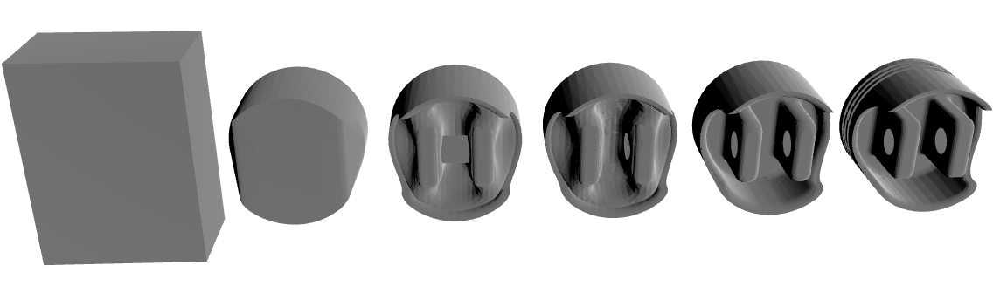

# Pricing Overview

Quantity | Base Price | Expedite Price | Expedite Subtotal | Expedite Lead Time | Standard Price | Standard Subtotal | Standard Lead Time | Economy Price | Economy Subtotal | Economy Lead Time | Machine Time | Machine Cost | Tool Used | Tool Cost | Material Cost | Material Waste Handling | Setup Cost | Expedite Fees | Standard Fees | Economy Fees | Expedite Margin | Standard Margin | Economy Margin | Risk Surcharge
--- | --- | --- | --- | --- | --- | --- | --- | --- | --- | --- | --- | --- | --- | --- | --- | --- | --- | --- | --- | --- | --- | --- | --- | ---
1 | $350.85 | $1509.18 | $1509.18 | 6 days | $873.96 | $873.96 | 7 days | $456.11 | $456.11 | 10 days | 13.47 minutes | $53.72 | 1.0 | $0.0 | $61.81 | $27.79 | $143.3 | $667.14 | $222.38 | $0.0 | $491.19 | $300.73 | $105.26 | $59.3
2 | $265.48 | $763.79 | $1527.58 | 5 days | $513.37 | $1026.74 | 6 days | $326.7 | $653.4 | 9 days | 26.94 minutes | $107.44 | 1.0 | $0.0 | $123.62 | $55.58 | $143.3 | $266.31 | $88.77 | $0.0 | $232.0 | $159.12 | $61.22 | $91.16
3 | $236.17 | $602.41 | $1807.23 | 5 days | $422.23 | $1266.69 | 6 days | $284.14 | $852.42 | 9 days | 40.41 minutes | $161.16 | 1.0 | $0.0 | $185.43 | $83.37 | $143.3 | $197.05 | $65.68 | $0.0 | $169.19 | $120.38 | $47.97 | $120.45
4 | $221.1 | $527.9 | $2111.6 | 5 days | $378.43 | $1513.72 | 6 days | $262.5 | $1050.0 | 9 days | 53.88 minutes | $214.88 | 1.0 | $0.0 | $247.24 | $111.16 | $143.3 | $166.36 | $55.45 | $0.0 | $140.44 | $101.88 | $41.4 | $148.08
5 | $211.81 | $483.89 | $2419.45 | 6 days | $352.12 | $1760.6 | 7 days | $249.21 | $1246.05 | 10 days | 67.36 minutes | $268.6 | 1.0 | $0.0 | $309.05 | $138.95 | $143.3 | $148.42 | $49.47 | $0.0 | $123.66 | $90.84 | $37.4 | $174.5
10 | $201.23 | $411.95 | $4119.5 | 7 days | $311.19 | $3111.9 | 8 days | $231.41 | $2314.1 | 11 days | 134.71 minutes | $537.2 | 2.0 | $75.0 | $618.1 | $277.9 | $143.3 | $116.81 | $38.94 | $0.0 | $93.91 | $71.02 | $30.18 | $311.5
15 | $190.97 | $370.96 | $5564.4 | 8 days | $285.45 | $4281.75 | 9 days | $217.3 | $3259.5 | 13 days | 202.06 minutes | $805.8 | 2.0 | $75.0 | $927.15 | $416.85 | $143.3 | $100.23 | $33.41 | $0.0 | $79.76 | $61.07 | $26.33 | $422.55
20 | $190.0 | $357.24 | $7144.8 | 9 days | $278.1 | $5562.0 | 10 days | $214.77 | $4295.4 | 14 days | 269.42 minutes | $1074.4 | 3.0 | $150.0 | $1236.2 | $555.8 | $143.3 | $93.39 | $31.13 | $0.0 | $73.85 | $56.97 | $24.77 | $541.6
25 | $185.71 | $341.08 | $8527.0 | 10 days | $267.78 | $6694.5 | 11 days | $208.94 | $5223.5 | 16 days | 336.78 minutes | $1343.0 | 3.0 | $150.0 | $1545.25 | $694.75 | $143.3 | $86.88 | $28.96 | $0.0 | $68.49 | $53.11 | $23.23 | $643.25

# Complexity

Overall Part Complexity Score: 60.46 (moderate)

## Complexity Breakdown

- **material_removal_intensity**: 10.08 points (weight: 15%)
  - *How aggressively the part reduces stock (from stock→part volume).*
- **surface_amplification**: 16.82 points (weight: 20%)
  - *Increase in surface area per volume vs stock (complexity of skin/fixturing/finishing).*
- **face_complexity**: 16.34 points (weight: 15%)
  - *Triangle-count complexity (log-scaled so very large meshes don't dominate).*
- **sharp_edge_intensity**: 0.92 points (weight: 10%)
  - *Sharp-edge density (sharp edges per face), saturated.*
- **holes_and_orients**: 2.4 points (weight: 10%)
  - *Hole count and number of drilling orientations (setup/fixturing burden).*
- **detail_intensity**: 13.9 points (weight: 30%)
  - *Deep/medium/fine cavity volume fractions (tool reach & small-feature effort).*# Machining Summary

- **Machine Type:** haas_cnc_machine
- **Material Removal Rate from Stock -> Convex:** 400000 mm^3/min
- **Material Removal Rate for deep pockets:** 75000 mm^3/min
- **Material Removal Rate for holes:** 400000 mm^3/min
- **Material Removal Rate for large features:** 75000 mm^3/min
- **Material Removal Rate for fine features:** 15000 mm^3/min
- **Total Material Removed from Stock -> Convex:** 1517765.255 mm^3
- **Total Material Removed for deep pockets:** 243923.753 mm^3
- **Total Material Removed for holes:** -22961.643 mm^3
- **Total Material Removed for large features:** 278295.645 mm^3
- **Total Material Removed for fine features:** 41569.398 mm^3

# Per-Quantity Breakdowns

### Qty 1 — Unit Price Breakdown

**Fees:**
  - Base Price: $350.85
  - Expedite Fees: $667.14
  - Standard Fees: $222.38
  - Economy Fees: $0.0
  - Expedite Margin: $491.19
  - Standard Margin: $300.73
  - Economy Margin: $105.26

**Tools:**
  - Wear: $32.72
  - Tool Change Labor & Cost: $0.0

**Machine:**
  - Time Used: 13.47 minutes
  - Cost: $53.72

**Material:**
  - Stock Weight: 6.8 kg
  - Stock Price: $34.02
  - Waste Handling: $27.79
  - Total Material Cost: $61.81

**Setup:**
  - Cost: $143.3

**Risk:**
  - Complexity: 60.46 (moderate)
  - Risk: 1.4
  - Applied Risk (Goes down at scale): 1.4
  - Cost: $59.3

### Qty 2 — Unit Price Breakdown

**Fees:**
  - Base Price: $265.48
  - Expedite Fees: $133.16
  - Standard Fees: $44.38
  - Economy Fees: $0.0
  - Expedite Margin: $116.0
  - Standard Margin: $79.56
  - Economy Margin: $30.61

**Tools:**
  - Wear: $32.72
  - Tool Change Labor & Cost: $0.0

**Machine:**
  - Time Used: 13.47 minutes
  - Cost: $53.72

**Material:**
  - Stock Weight: 6.8 kg
  - Stock Price: $34.02
  - Waste Handling: $27.79
  - Total Material Cost: $61.81

**Setup:**
  - Cost: $71.65

**Risk:**
  - Complexity: 60.46 (moderate)
  - Risk: 1.4
  - Applied Risk (Goes down at scale): 1.31
  - Cost: $45.58

### Qty 3 — Unit Price Breakdown

**Fees:**
  - Base Price: $236.17
  - Expedite Fees: $65.68
  - Standard Fees: $21.89
  - Economy Fees: $0.0
  - Expedite Margin: $56.4
  - Standard Margin: $40.13
  - Economy Margin: $15.99

**Tools:**
  - Wear: $32.72
  - Tool Change Labor & Cost: $0.0

**Machine:**
  - Time Used: 13.47 minutes
  - Cost: $53.72

**Material:**
  - Stock Weight: 6.8 kg
  - Stock Price: $34.02
  - Waste Handling: $27.79
  - Total Material Cost: $61.81

**Setup:**
  - Cost: $47.77

**Risk:**
  - Complexity: 60.46 (moderate)
  - Risk: 1.4
  - Applied Risk (Goes down at scale): 1.27
  - Cost: $40.15

### Qty 4 — Unit Price Breakdown

**Fees:**
  - Base Price: $221.1
  - Expedite Fees: $41.59
  - Standard Fees: $13.86
  - Economy Fees: $0.0
  - Expedite Margin: $35.11
  - Standard Margin: $25.47
  - Economy Margin: $10.35

**Tools:**
  - Wear: $32.72
  - Tool Change Labor & Cost: $0.0

**Machine:**
  - Time Used: 13.47 minutes
  - Cost: $53.72

**Material:**
  - Stock Weight: 6.8 kg
  - Stock Price: $34.02
  - Waste Handling: $27.79
  - Total Material Cost: $61.81

**Setup:**
  - Cost: $35.83

**Risk:**
  - Complexity: 60.46 (moderate)
  - Risk: 1.4
  - Applied Risk (Goes down at scale): 1.25
  - Cost: $37.02

### Qty 5 — Unit Price Breakdown

**Fees:**
  - Base Price: $211.81
  - Expedite Fees: $29.68
  - Standard Fees: $9.89
  - Economy Fees: $0.0
  - Expedite Margin: $24.73
  - Standard Margin: $18.17
  - Economy Margin: $7.48

**Tools:**
  - Wear: $32.72
  - Tool Change Labor & Cost: $0.0

**Machine:**
  - Time Used: 13.47 minutes
  - Cost: $53.72

**Material:**
  - Stock Weight: 6.8 kg
  - Stock Price: $34.02
  - Waste Handling: $27.79
  - Total Material Cost: $61.81

**Setup:**
  - Cost: $28.66

**Risk:**
  - Complexity: 60.46 (moderate)
  - Risk: 1.4
  - Applied Risk (Goes down at scale): 1.24
  - Cost: $34.9

### Qty 10 — Unit Price Breakdown

**Fees:**
  - Base Price: $201.23
  - Expedite Fees: $11.68
  - Standard Fees: $3.89
  - Economy Fees: $0.0
  - Expedite Margin: $9.39
  - Standard Margin: $7.1
  - Economy Margin: $3.02

**Tools:**
  - Wear: $32.72
  - Tool Change Labor & Cost: $7.5

**Machine:**
  - Time Used: 13.47 minutes
  - Cost: $53.72

**Material:**
  - Stock Weight: 6.8 kg
  - Stock Price: $34.02
  - Waste Handling: $27.79
  - Total Material Cost: $61.81

**Setup:**
  - Cost: $14.33

**Risk:**
  - Complexity: 60.46 (moderate)
  - Risk: 1.4
  - Applied Risk (Goes down at scale): 1.2
  - Cost: $31.15

### Qty 15 — Unit Price Breakdown

**Fees:**
  - Base Price: $190.97
  - Expedite Fees: $6.68
  - Standard Fees: $2.23
  - Economy Fees: $0.0
  - Expedite Margin: $5.32
  - Standard Margin: $4.07
  - Economy Margin: $1.76

**Tools:**
  - Wear: $32.72
  - Tool Change Labor & Cost: $5.0

**Machine:**
  - Time Used: 13.47 minutes
  - Cost: $53.72

**Material:**
  - Stock Weight: 6.8 kg
  - Stock Price: $34.02
  - Waste Handling: $27.79
  - Total Material Cost: $61.81

**Setup:**
  - Cost: $9.55

**Risk:**
  - Complexity: 60.46 (moderate)
  - Risk: 1.4
  - Applied Risk (Goes down at scale): 1.18
  - Cost: $28.17

### Qty 20 — Unit Price Breakdown

**Fees:**
  - Base Price: $190.0
  - Expedite Fees: $4.67
  - Standard Fees: $1.56
  - Economy Fees: $0.0
  - Expedite Margin: $3.69
  - Standard Margin: $2.85
  - Economy Margin: $1.24

**Tools:**
  - Wear: $32.72
  - Tool Change Labor & Cost: $7.5

**Machine:**
  - Time Used: 13.47 minutes
  - Cost: $53.72

**Material:**
  - Stock Weight: 6.8 kg
  - Stock Price: $34.02
  - Waste Handling: $27.79
  - Total Material Cost: $61.81

**Setup:**
  - Cost: $7.17

**Risk:**
  - Complexity: 60.46 (moderate)
  - Risk: 1.4
  - Applied Risk (Goes down at scale): 1.17
  - Cost: $27.08

### Qty 25 — Unit Price Breakdown

**Fees:**
  - Base Price: $185.71
  - Expedite Fees: $3.48
  - Standard Fees: $1.16
  - Economy Fees: $0.0
  - Expedite Margin: $2.74
  - Standard Margin: $2.12
  - Economy Margin: $0.93

**Tools:**
  - Wear: $32.72
  - Tool Change Labor & Cost: $6.0

**Machine:**
  - Time Used: 13.47 minutes
  - Cost: $53.72

**Material:**
  - Stock Weight: 6.8 kg
  - Stock Price: $34.02
  - Waste Handling: $27.79
  - Total Material Cost: $61.81

**Setup:**
  - Cost: $5.73

**Risk:**
  - Complexity: 60.46 (moderate)
  - Risk: 1.4
  - Applied Risk (Goes down at scale): 1.17
  - Cost: $25.73
