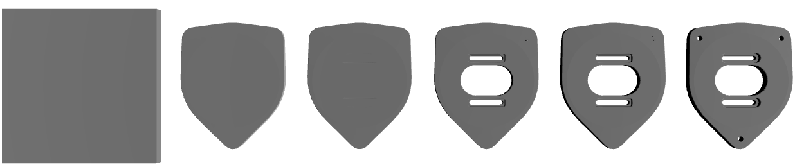

# Pricing Overview

Quantity | Base Price | Expedite Price | Expedite Subtotal | Expedite Lead Time | Standard Price | Standard Subtotal | Standard Lead Time | Economy Price | Economy Subtotal | Economy Lead Time | Machine Time | Machine Cost | Tool Used | Tool Cost | Material Cost | Material Waste Handling | Setup Cost | Expedite Fees | Standard Fees | Economy Fees | Expedite Margin | Standard Margin | Economy Margin | Risk Surcharge
--- | --- | --- | --- | --- | --- | --- | --- | --- | --- | --- | --- | --- | --- | --- | --- | --- | --- | --- | --- | --- | --- | --- | --- | ---
1 | $162.94 | $522.24 | $522.24 | 5 days | $346.33 | $346.33 | 6 days | $211.82 | $211.82 | 8 days | 1.54 minutes | $9.01 | 1.0 | $0.0 | $17.01 | $7.29 | $132.33 | $131.18 | $43.73 | $0.0 | $228.12 | $139.66 | $48.88 | $1.46
2 | $96.44 | $233.09 | $466.18 | 4 days | $171.7 | $343.4 | 5 days | $118.68 | $237.36 | 8 days | 3.08 minutes | $18.02 | 1.0 | $0.0 | $34.02 | $14.58 | $132.33 | $52.37 | $17.46 | $0.0 | $84.28 | $57.8 | $22.24 | $2.24
3 | $74.25 | $166.19 | $498.57 | 4 days | $125.02 | $375.06 | 5 days | $89.33 | $267.99 | 8 days | 4.62 minutes | $27.03 | 1.0 | $0.0 | $51.03 | $21.87 | $132.33 | $38.75 | $12.92 | $0.0 | $53.19 | $37.85 | $15.08 | $2.97
4 | $63.14 | $135.95 | $543.8 | 4 days | $103.14 | $412.56 | 5 days | $74.96 | $299.84 | 8 days | 6.16 minutes | $36.04 | 1.0 | $0.0 | $68.04 | $29.16 | $132.33 | $32.71 | $10.9 | $0.0 | $40.1 | $29.1 | $11.82 | $3.64
5 | $56.48 | $118.64 | $593.2 | 4 days | $90.43 | $452.15 | 5 days | $66.45 | $332.25 | 8 days | 7.7 minutes | $45.05 | 1.0 | $0.0 | $85.05 | $36.45 | $132.33 | $29.19 | $9.73 | $0.0 | $32.97 | $24.22 | $9.97 | $4.3
10 | $43.11 | $85.09 | $850.9 | 5 days | $65.62 | $656.2 | 6 days | $49.58 | $495.8 | 9 days | 15.4 minutes | $90.1 | 1.0 | $0.0 | $170.1 | $72.9 | $132.33 | $21.86 | $7.29 | $0.0 | $20.12 | $15.22 | $6.47 | $7.3
15 | $38.64 | $73.85 | $1107.75 | 5 days | $57.36 | $860.4 | 6 days | $43.97 | $659.55 | 9 days | 23.1 minutes | $135.15 | 1.0 | $0.0 | $255.15 | $109.35 | $132.33 | $19.07 | $6.36 | $0.0 | $16.14 | $12.36 | $5.33 | $10.05
20 | $36.4 | $68.03 | $1360.6 | 6 days | $53.14 | $1062.8 | 7 days | $41.15 | $823.0 | 10 days | 30.8 minutes | $180.2 | 1.0 | $0.0 | $340.2 | $145.8 | $132.33 | $17.48 | $5.83 | $0.0 | $14.15 | $10.91 | $4.75 | $12.6
25 | $35.05 | $64.4 | $1610.0 | 7 days | $50.54 | $1263.5 | 8 days | $39.44 | $986.0 | 11 days | 38.5 minutes | $225.25 | 1.0 | $0.0 | $425.25 | $182.25 | $132.33 | $16.42 | $5.47 | $0.0 | $12.93 | $10.02 | $4.39 | $15.25

# Complexity

Overall Part Complexity Score: 36.89 (moderate)

## Complexity Breakdown

- **material_removal_intensity**: 7.93 points (weight: 15%)
  - *How aggressively the part reduces stock (from stock→part volume).*
- **surface_amplification**: 9.03 points (weight: 20%)
  - *Increase in surface area per volume vs stock (complexity of skin/fixturing/finishing).*
- **face_complexity**: 14.92 points (weight: 15%)
  - *Triangle-count complexity (log-scaled so very large meshes don't dominate).*
- **sharp_edge_intensity**: 2.13 points (weight: 10%)
  - *Sharp-edge density (sharp edges per face), saturated.*
- **holes_and_orients**: 2.75 points (weight: 10%)
  - *Hole count and number of drilling orientations (setup/fixturing burden).*
- **detail_intensity**: 0.12 points (weight: 30%)
  - *Deep/medium/fine cavity volume fractions (tool reach & small-feature effort).*# Machining Summary

- **Machine Type:** haas_cnc_machine
- **Material Removal Rate from Stock -> Convex:** 400000 mm^3/min
- **Material Removal Rate for deep pockets:** 75000 mm^3/min
- **Material Removal Rate for holes:** 400000 mm^3/min
- **Material Removal Rate for large features:** 75000 mm^3/min
- **Material Removal Rate for fine features:** 15000 mm^3/min
- **Total Material Removed from Stock -> Convex:** 497484.06 mm^3
- **Total Material Removed for deep pockets:** 332.09 mm^3
- **Total Material Removed for holes:** 39641.864 mm^3
- **Total Material Removed for large features:** 4.659 mm^3
- **Total Material Removed for fine features:** 2896.027 mm^3

# Per-Quantity Breakdowns

### Qty 1 — Unit Price Breakdown

**Fees:**
  - Base Price: $162.94
  - Expedite Fees: $131.18
  - Standard Fees: $43.73
  - Economy Fees: $0.0
  - Expedite Margin: $228.12
  - Standard Margin: $139.66
  - Economy Margin: $48.88

**Tools:**
  - Wear: $3.13
  - Tool Change Labor & Cost: $0.0

**Machine:**
  - Time Used: 1.54 minutes
  - Cost: $9.01

**Material:**
  - Stock Weight: 1.94 kg
  - Stock Price: $9.72
  - Waste Handling: $7.29
  - Total Material Cost: $17.01

**Setup:**
  - Cost: $132.33

**Risk:**
  - Complexity: 36.89 (moderate)
  - Risk: 1.05
  - Applied Risk (Goes down at scale): 1.05
  - Cost: $1.46

### Qty 2 — Unit Price Breakdown

**Fees:**
  - Base Price: $96.44
  - Expedite Fees: $26.18
  - Standard Fees: $8.73
  - Economy Fees: $0.0
  - Expedite Margin: $42.14
  - Standard Margin: $28.9
  - Economy Margin: $11.12

**Tools:**
  - Wear: $3.13
  - Tool Change Labor & Cost: $0.0

**Machine:**
  - Time Used: 1.54 minutes
  - Cost: $9.01

**Material:**
  - Stock Weight: 1.94 kg
  - Stock Price: $9.72
  - Waste Handling: $7.29
  - Total Material Cost: $17.01

**Setup:**
  - Cost: $66.17

**Risk:**
  - Complexity: 36.89 (moderate)
  - Risk: 1.05
  - Applied Risk (Goes down at scale): 1.04
  - Cost: $1.12

### Qty 3 — Unit Price Breakdown

**Fees:**
  - Base Price: $74.25
  - Expedite Fees: $12.92
  - Standard Fees: $4.31
  - Economy Fees: $0.0
  - Expedite Margin: $17.73
  - Standard Margin: $12.62
  - Economy Margin: $5.03

**Tools:**
  - Wear: $3.13
  - Tool Change Labor & Cost: $0.0

**Machine:**
  - Time Used: 1.54 minutes
  - Cost: $9.01

**Material:**
  - Stock Weight: 1.94 kg
  - Stock Price: $9.72
  - Waste Handling: $7.29
  - Total Material Cost: $17.01

**Setup:**
  - Cost: $44.11

**Risk:**
  - Complexity: 36.89 (moderate)
  - Risk: 1.05
  - Applied Risk (Goes down at scale): 1.03
  - Cost: $0.99

### Qty 4 — Unit Price Breakdown

**Fees:**
  - Base Price: $63.14
  - Expedite Fees: $8.18
  - Standard Fees: $2.72
  - Economy Fees: $0.0
  - Expedite Margin: $10.02
  - Standard Margin: $7.28
  - Economy Margin: $2.96

**Tools:**
  - Wear: $3.13
  - Tool Change Labor & Cost: $0.0

**Machine:**
  - Time Used: 1.54 minutes
  - Cost: $9.01

**Material:**
  - Stock Weight: 1.94 kg
  - Stock Price: $9.72
  - Waste Handling: $7.29
  - Total Material Cost: $17.01

**Setup:**
  - Cost: $33.08

**Risk:**
  - Complexity: 36.89 (moderate)
  - Risk: 1.05
  - Applied Risk (Goes down at scale): 1.03
  - Cost: $0.91

### Qty 5 — Unit Price Breakdown

**Fees:**
  - Base Price: $56.48
  - Expedite Fees: $5.84
  - Standard Fees: $1.95
  - Economy Fees: $0.0
  - Expedite Margin: $6.59
  - Standard Margin: $4.84
  - Economy Margin: $1.99

**Tools:**
  - Wear: $3.13
  - Tool Change Labor & Cost: $0.0

**Machine:**
  - Time Used: 1.54 minutes
  - Cost: $9.01

**Material:**
  - Stock Weight: 1.94 kg
  - Stock Price: $9.72
  - Waste Handling: $7.29
  - Total Material Cost: $17.01

**Setup:**
  - Cost: $26.47

**Risk:**
  - Complexity: 36.89 (moderate)
  - Risk: 1.05
  - Applied Risk (Goes down at scale): 1.03
  - Cost: $0.86

### Qty 10 — Unit Price Breakdown

**Fees:**
  - Base Price: $43.11
  - Expedite Fees: $2.19
  - Standard Fees: $0.73
  - Economy Fees: $0.0
  - Expedite Margin: $2.01
  - Standard Margin: $1.52
  - Economy Margin: $0.65

**Tools:**
  - Wear: $3.13
  - Tool Change Labor & Cost: $0.0

**Machine:**
  - Time Used: 1.54 minutes
  - Cost: $9.01

**Material:**
  - Stock Weight: 1.94 kg
  - Stock Price: $9.72
  - Waste Handling: $7.29
  - Total Material Cost: $17.01

**Setup:**
  - Cost: $13.23

**Risk:**
  - Complexity: 36.89 (moderate)
  - Risk: 1.05
  - Applied Risk (Goes down at scale): 1.02
  - Cost: $0.73

### Qty 15 — Unit Price Breakdown

**Fees:**
  - Base Price: $38.64
  - Expedite Fees: $1.27
  - Standard Fees: $0.42
  - Economy Fees: $0.0
  - Expedite Margin: $1.08
  - Standard Margin: $0.82
  - Economy Margin: $0.36

**Tools:**
  - Wear: $3.13
  - Tool Change Labor & Cost: $0.0

**Machine:**
  - Time Used: 1.54 minutes
  - Cost: $9.01

**Material:**
  - Stock Weight: 1.94 kg
  - Stock Price: $9.72
  - Waste Handling: $7.29
  - Total Material Cost: $17.01

**Setup:**
  - Cost: $8.82

**Risk:**
  - Complexity: 36.89 (moderate)
  - Risk: 1.05
  - Applied Risk (Goes down at scale): 1.02
  - Cost: $0.67

### Qty 20 — Unit Price Breakdown

**Fees:**
  - Base Price: $36.4
  - Expedite Fees: $0.87
  - Standard Fees: $0.29
  - Economy Fees: $0.0
  - Expedite Margin: $0.71
  - Standard Margin: $0.55
  - Economy Margin: $0.24

**Tools:**
  - Wear: $3.13
  - Tool Change Labor & Cost: $0.0

**Machine:**
  - Time Used: 1.54 minutes
  - Cost: $9.01

**Material:**
  - Stock Weight: 1.94 kg
  - Stock Price: $9.72
  - Waste Handling: $7.29
  - Total Material Cost: $17.01

**Setup:**
  - Cost: $6.62

**Risk:**
  - Complexity: 36.89 (moderate)
  - Risk: 1.05
  - Applied Risk (Goes down at scale): 1.02
  - Cost: $0.63

### Qty 25 — Unit Price Breakdown

**Fees:**
  - Base Price: $35.05
  - Expedite Fees: $0.66
  - Standard Fees: $0.22
  - Economy Fees: $0.0
  - Expedite Margin: $0.52
  - Standard Margin: $0.4
  - Economy Margin: $0.18

**Tools:**
  - Wear: $3.13
  - Tool Change Labor & Cost: $0.0

**Machine:**
  - Time Used: 1.54 minutes
  - Cost: $9.01

**Material:**
  - Stock Weight: 1.94 kg
  - Stock Price: $9.72
  - Waste Handling: $7.29
  - Total Material Cost: $17.01

**Setup:**
  - Cost: $5.29

**Risk:**
  - Complexity: 36.89 (moderate)
  - Risk: 1.05
  - Applied Risk (Goes down at scale): 1.02
  - Cost: $0.61
