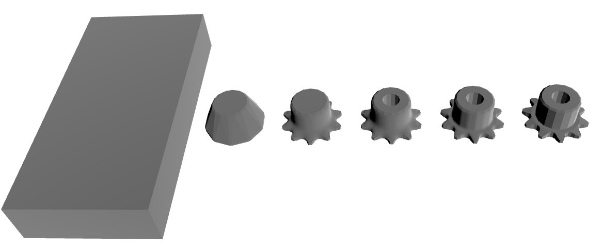
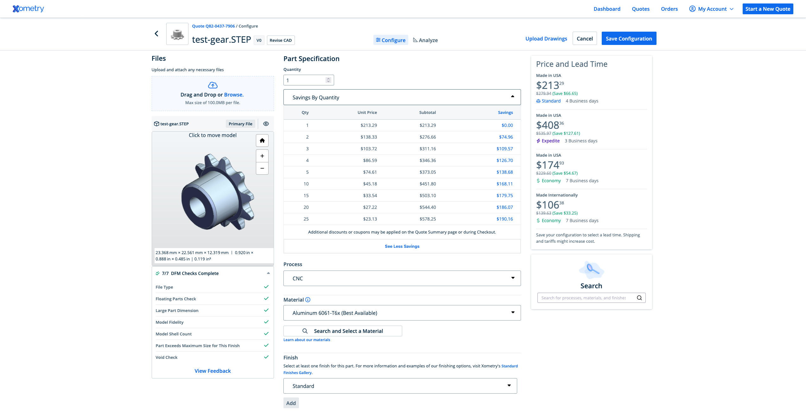

# Pricing Overview

Quantity | Base Price | Expedite Price | Expedite Subtotal | Expedite Lead Time | Standard Price | Standard Subtotal | Standard Lead Time | Economy Price | Economy Subtotal | Economy Lead Time | Machine Time | Machine Cost | Tool Used | Tool Cost | Material Cost | Material Waste Handling | Setup Cost | Expedite Fees | Standard Fees | Economy Fees | Expedite Margin | Standard Margin | Economy Margin | Risk Surcharge
--- | --- | --- | --- | --- | --- | --- | --- | --- | --- | --- | --- | --- | --- | --- | --- | --- | --- | --- | --- | --- | --- | --- | --- | ---
1 | $146.17 | $420.9 | $420.9 | 5 days | $294.82 | $294.82 | 6 days | $190.02 | $190.02 | 9 days | 0.24 minutes | $12.65 | 1.0 | $0.0 | $2.41 | $1.19 | $129.81 | $70.09 | $23.36 | $0.0 | $204.64 | $125.29 | $43.85 | $0.78
2 | $81.09 | $179.93 | $359.86 | 4 days | $139.02 | $278.04 | 5 days | $99.79 | $199.58 | 8 days | 0.48 minutes | $25.3 | 1.0 | $0.0 | $4.82 | $2.38 | $129.81 | $27.98 | $9.33 | $0.0 | $70.86 | $48.6 | $18.7 | $1.2
3 | $59.38 | $122.62 | $367.86 | 4 days | $96.55 | $289.65 | 5 days | $71.44 | $214.32 | 8 days | 0.71 minutes | $37.95 | 1.0 | $0.0 | $7.23 | $3.57 | $129.81 | $20.7 | $6.9 | $0.0 | $42.54 | $30.27 | $12.06 | $1.59
4 | $48.52 | $96.82 | $387.28 | 4 days | $76.71 | $306.84 | 5 days | $57.61 | $230.44 | 8 days | 0.95 minutes | $50.6 | 1.0 | $0.0 | $9.64 | $4.76 | $129.81 | $17.48 | $5.83 | $0.0 | $30.82 | $22.36 | $9.09 | $1.96
5 | $42.0 | $82.11 | $410.55 | 4 days | $65.21 | $326.05 | 5 days | $49.42 | $247.1 | 8 days | 1.19 minutes | $63.25 | 1.0 | $0.0 | $12.05 | $5.95 | $129.81 | $15.59 | $5.2 | $0.0 | $24.52 | $18.01 | $7.42 | $2.3
10 | $28.95 | $54.14 | $541.4 | 5 days | $43.06 | $430.6 | 6 days | $33.29 | $332.9 | 9 days | 2.38 minutes | $126.5 | 1.0 | $0.0 | $24.1 | $11.9 | $129.81 | $11.68 | $3.89 | $0.0 | $13.51 | $10.22 | $4.34 | $3.9
15 | $24.59 | $45.05 | $675.75 | 6 days | $35.85 | $537.75 | 7 days | $27.98 | $419.7 | 10 days | 3.57 minutes | $189.75 | 1.0 | $0.0 | $36.15 | $17.85 | $129.81 | $10.19 | $3.4 | $0.0 | $10.27 | $7.86 | $3.39 | $5.4
20 | $22.41 | $40.46 | $809.2 | 6 days | $32.24 | $644.8 | 7 days | $25.33 | $506.6 | 11 days | 4.76 minutes | $253.0 | 1.0 | $0.0 | $48.2 | $23.8 | $129.81 | $9.34 | $3.11 | $0.0 | $8.71 | $6.72 | $2.92 | $6.8
25 | $21.09 | $37.64 | $941.0 | 7 days | $30.04 | $751.0 | 8 days | $23.73 | $593.25 | 12 days | 5.95 minutes | $316.25 | 1.0 | $0.0 | $60.25 | $29.75 | $129.81 | $8.77 | $2.92 | $0.0 | $7.78 | $6.03 | $2.64 | $8.0

# Complexity

Overall Part Complexity Score: 54.61 (moderate)

## Complexity Breakdown

- **material_removal_intensity**: 15.0 points (weight: 15%)
  - *How aggressively the part reduces stock (from stock→part volume).*
- **surface_amplification**: 16.99 points (weight: 20%)
  - *Increase in surface area per volume vs stock (complexity of skin/fixturing/finishing).*
- **face_complexity**: 13.04 points (weight: 15%)
  - *Triangle-count complexity (log-scaled so very large meshes don't dominate).*
- **sharp_edge_intensity**: 0.27 points (weight: 10%)
  - *Sharp-edge density (sharp edges per face), saturated.*
- **holes_and_orients**: 0.82 points (weight: 10%)
  - *Hole count and number of drilling orientations (setup/fixturing burden).*
- **detail_intensity**: 8.49 points (weight: 30%)
  - *Deep/medium/fine cavity volume fractions (tool reach & small-feature effort).*# Machining Summary

- **Machine Type:** haas_cnc_machine
- **Material Removal Rate from Stock -> Convex:** 400000 mm^3/min
- **Material Removal Rate for deep pockets:** 75000 mm^3/min
- **Material Removal Rate for holes:** 400000 mm^3/min
- **Material Removal Rate for large features:** 75000 mm^3/min
- **Material Removal Rate for fine features:** 15000 mm^3/min
- **Total Material Removed from Stock -> Convex:** 86491.631 mm^3
- **Total Material Removed for deep pockets:** 969.813 mm^3
- **Total Material Removed for holes:** 372.549 mm^3
- **Total Material Removed for large features:** 142.905 mm^3
- **Total Material Removed for fine features:** 93.116 mm^3

# Per-Quantity Breakdowns

### Qty 1 — Unit Price Breakdown

**Fees:**
  - Base Price: $146.17
  - Expedite Fees: $70.09
  - Standard Fees: $23.36
  - Economy Fees: $0.0
  - Expedite Margin: $204.64
  - Standard Margin: $125.29
  - Economy Margin: $43.85

**Tools:**
  - Wear: $0.52
  - Tool Change Labor & Cost: $0.0

**Machine:**
  - Time Used: 0.24 minutes
  - Cost: $12.65

**Material:**
  - Stock Weight: 0.24 kg
  - Stock Price: $1.22
  - Waste Handling: $1.19
  - Total Material Cost: $2.41

**Setup:**
  - Cost: $129.81

**Risk:**
  - Complexity: 54.61 (moderate)
  - Risk: 1.05
  - Applied Risk (Goes down at scale): 1.05
  - Cost: $0.78

### Qty 2 — Unit Price Breakdown

**Fees:**
  - Base Price: $81.09
  - Expedite Fees: $13.99
  - Standard Fees: $4.66
  - Economy Fees: $0.0
  - Expedite Margin: $35.43
  - Standard Margin: $24.3
  - Economy Margin: $9.35

**Tools:**
  - Wear: $0.52
  - Tool Change Labor & Cost: $0.0

**Machine:**
  - Time Used: 0.24 minutes
  - Cost: $12.65

**Material:**
  - Stock Weight: 0.24 kg
  - Stock Price: $1.22
  - Waste Handling: $1.19
  - Total Material Cost: $2.41

**Setup:**
  - Cost: $64.91

**Risk:**
  - Complexity: 54.61 (moderate)
  - Risk: 1.05
  - Applied Risk (Goes down at scale): 1.04
  - Cost: $0.6

### Qty 3 — Unit Price Breakdown

**Fees:**
  - Base Price: $59.38
  - Expedite Fees: $6.9
  - Standard Fees: $2.3
  - Economy Fees: $0.0
  - Expedite Margin: $14.18
  - Standard Margin: $10.09
  - Economy Margin: $4.02

**Tools:**
  - Wear: $0.52
  - Tool Change Labor & Cost: $0.0

**Machine:**
  - Time Used: 0.24 minutes
  - Cost: $12.65

**Material:**
  - Stock Weight: 0.24 kg
  - Stock Price: $1.22
  - Waste Handling: $1.19
  - Total Material Cost: $2.41

**Setup:**
  - Cost: $43.27

**Risk:**
  - Complexity: 54.61 (moderate)
  - Risk: 1.05
  - Applied Risk (Goes down at scale): 1.03
  - Cost: $0.53

### Qty 4 — Unit Price Breakdown

**Fees:**
  - Base Price: $48.52
  - Expedite Fees: $4.37
  - Standard Fees: $1.46
  - Economy Fees: $0.0
  - Expedite Margin: $7.7
  - Standard Margin: $5.59
  - Economy Margin: $2.27

**Tools:**
  - Wear: $0.52
  - Tool Change Labor & Cost: $0.0

**Machine:**
  - Time Used: 0.24 minutes
  - Cost: $12.65

**Material:**
  - Stock Weight: 0.24 kg
  - Stock Price: $1.22
  - Waste Handling: $1.19
  - Total Material Cost: $2.41

**Setup:**
  - Cost: $32.45

**Risk:**
  - Complexity: 54.61 (moderate)
  - Risk: 1.05
  - Applied Risk (Goes down at scale): 1.03
  - Cost: $0.49

### Qty 5 — Unit Price Breakdown

**Fees:**
  - Base Price: $42.0
  - Expedite Fees: $3.12
  - Standard Fees: $1.04
  - Economy Fees: $0.0
  - Expedite Margin: $4.9
  - Standard Margin: $3.6
  - Economy Margin: $1.48

**Tools:**
  - Wear: $0.52
  - Tool Change Labor & Cost: $0.0

**Machine:**
  - Time Used: 0.24 minutes
  - Cost: $12.65

**Material:**
  - Stock Weight: 0.24 kg
  - Stock Price: $1.22
  - Waste Handling: $1.19
  - Total Material Cost: $2.41

**Setup:**
  - Cost: $25.96

**Risk:**
  - Complexity: 54.61 (moderate)
  - Risk: 1.05
  - Applied Risk (Goes down at scale): 1.03
  - Cost: $0.46

### Qty 10 — Unit Price Breakdown

**Fees:**
  - Base Price: $28.95
  - Expedite Fees: $1.17
  - Standard Fees: $0.39
  - Economy Fees: $0.0
  - Expedite Margin: $1.35
  - Standard Margin: $1.02
  - Economy Margin: $0.43

**Tools:**
  - Wear: $0.52
  - Tool Change Labor & Cost: $0.0

**Machine:**
  - Time Used: 0.24 minutes
  - Cost: $12.65

**Material:**
  - Stock Weight: 0.24 kg
  - Stock Price: $1.22
  - Waste Handling: $1.19
  - Total Material Cost: $2.41

**Setup:**
  - Cost: $12.98

**Risk:**
  - Complexity: 54.61 (moderate)
  - Risk: 1.05
  - Applied Risk (Goes down at scale): 1.02
  - Cost: $0.39

### Qty 15 — Unit Price Breakdown

**Fees:**
  - Base Price: $24.59
  - Expedite Fees: $0.68
  - Standard Fees: $0.23
  - Economy Fees: $0.0
  - Expedite Margin: $0.68
  - Standard Margin: $0.52
  - Economy Margin: $0.23

**Tools:**
  - Wear: $0.52
  - Tool Change Labor & Cost: $0.0

**Machine:**
  - Time Used: 0.24 minutes
  - Cost: $12.65

**Material:**
  - Stock Weight: 0.24 kg
  - Stock Price: $1.22
  - Waste Handling: $1.19
  - Total Material Cost: $2.41

**Setup:**
  - Cost: $8.65

**Risk:**
  - Complexity: 54.61 (moderate)
  - Risk: 1.05
  - Applied Risk (Goes down at scale): 1.02
  - Cost: $0.36

### Qty 20 — Unit Price Breakdown

**Fees:**
  - Base Price: $22.41
  - Expedite Fees: $0.47
  - Standard Fees: $0.16
  - Economy Fees: $0.0
  - Expedite Margin: $0.44
  - Standard Margin: $0.34
  - Economy Margin: $0.15

**Tools:**
  - Wear: $0.52
  - Tool Change Labor & Cost: $0.0

**Machine:**
  - Time Used: 0.24 minutes
  - Cost: $12.65

**Material:**
  - Stock Weight: 0.24 kg
  - Stock Price: $1.22
  - Waste Handling: $1.19
  - Total Material Cost: $2.41

**Setup:**
  - Cost: $6.49

**Risk:**
  - Complexity: 54.61 (moderate)
  - Risk: 1.05
  - Applied Risk (Goes down at scale): 1.02
  - Cost: $0.34

### Qty 25 — Unit Price Breakdown

**Fees:**
  - Base Price: $21.09
  - Expedite Fees: $0.35
  - Standard Fees: $0.12
  - Economy Fees: $0.0
  - Expedite Margin: $0.31
  - Standard Margin: $0.24
  - Economy Margin: $0.11

**Tools:**
  - Wear: $0.52
  - Tool Change Labor & Cost: $0.0

**Machine:**
  - Time Used: 0.24 minutes
  - Cost: $12.65

**Material:**
  - Stock Weight: 0.24 kg
  - Stock Price: $1.22
  - Waste Handling: $1.19
  - Total Material Cost: $2.41

**Setup:**
  - Cost: $5.19

**Risk:**
  - Complexity: 54.61 (moderate)
  - Risk: 1.05
  - Applied Risk (Goes down at scale): 1.02
  - Cost: $0.32
